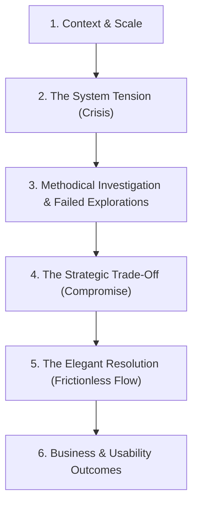

# The Master UX & Product Design Portfolio DNA Guide
A comprehensive, industry-proven guide for writing elite design case studies that attract top-tier product organizations (Meta, Google, Stripe, Figma, Airbnb). 

---

# Part 1: Core Writing Philosophy (Storytelling & Copywriting)

## 1. Storytelling Architecture
The absolute best case studies read like a **technical detective story**, not a passive retrospective. A standard portfolio chronologically lists step-by-step processes (research $\rightarrow$ wireframe $\rightarrow$ test $\rightarrow$ UI). An elite portfolio frames the project as a high-stakes struggle against constraints, trade-offs, and system complexity.



### The Arc Blueprint
1.  **Context & Scale**: Establish the baseline size and scope of the product or domain.
2.  **The Tension (The "Crisis")**: Introduce a major bottleneck. Why can't we just build a generic solution? What are the technological, platform, or human limits?
3.  **Methodical Investigation**: Break down explorations. Present ideas that *failed* or were discarded and explain *why*.
4.  **The Strategic Trade-Off**: Make a deliberate, professional compromise (e.g., sacrificing an ideal user flow to accommodate API limits, budget, or timeline).
5.  **The Elegant Resolution**: Reveal the final high-fidelity flow with frictionless visual documentation.
6.  **Business & User Impact**: Close with hard quantitative data and system outcomes.

---

## 2. Copywriting, Tone & Domain Literacy
Your writing style represents your professional identity. High-caliber tech companies look for the communication profile of a **systems thinker and collaborator**, not just a visual pixel-pusher.

```
                  [ SYSTEMS THINKING ]
        (Objective, Factual, Architecture-Minded)
                          ▲
                          │
  [ ACADEMIC ] ◄──────────┼──────────► [ DECORATIVE ]
(Dry, Theoretical)        │        (Exaggerated, Fluffy)
                          ▼
                  [ ACTION-ORIENTED ]
            (Frictionless, Direct, Collaborative)
```

### Writing Rules
*   **Factual & Objective**: Eliminate all corporate buzzwords (*"synergize," "disruptive"*) and self-congratulatory adjectives (*"elegantly solved," "beautifully designed," "gorgeous layout"*). Use neutral, active, objective descriptors. Let the craft speak for itself.
*   **Active First-Person**: Use a strong, collaborative active voice (*"I mapped out..."*, *"Our team prioritized..."*).
*   **Domain Literacy**: Integrate industry-standard terminology correctly (e.g., *"API limitations"*, *"data sync lag"*, *"cognitive friction"*, *"conversion funnel"*, *"keyboard focus states"*).

### The Writing Profile Blueprint
| Attribute | Best Practice |
| :--- | :--- |
| **Perspective** | Active First-Person (*"I validated," "We shipped"*) |
| **Sentence Structure** | Subject $\rightarrow$ Action $\rightarrow$ System Result |
| **Reading Level** | Flesch-Kincaid Grade 8–10 (conversational but technically literate) |
| **Aesthetic Adjectives** | Muted, descriptive (*"neutral dark layout," "collapsible side-panel"*) |

---

## 3. Case Study Writing Blueprints
Apply these concrete templates to translate generic UX activities into high-signal engineering and product narratives.

### A. Writing High-Impact Hooks (The Opening Sentence)
Never open a case study with generic introductory sentences (e.g., *"I was hired as a designer to help X redesign their website to increase engagement."*). A senior designer opens by establishing **scale and system tension**.

*   ❌ **Generic Hook**: *"In 2025, I was the lead designer for 1Password's macOS team. Our goal was to design an autofill feature for Mac apps because users wanted it."*
*   🚀 **High-Impact Senior Hook**: *"In early 2025, 1Password faced a critical platform gap: native macOS autofill was not supported, meaning millions of users were forced to manually copy credentials inside native desktop applications—severely degrading trust in our cross-platform ecosystem."*

### B. Writing About Research (Insights over Generic Personas)
Hiring managers universally ignore generic personas (e.g., *"This is Sarah, a 22-year-old student who wants things to be fast"*). Instead, write about **Actionable System Friction and Conflicting User Behaviors**.

*   ❌ **Generic Research Prose**: *"We conducted 5 user interviews and created user personas. We learned that users want a secure password manager that is also quick and easy to use."*
*   🚀 **Insight-Driven Writing**: *"Our interviews revealed a fundamental behavioral conflict: users demanded maximum security (which requires friction points like biometric re-auth), yet simultaneously abandoned the funnel if autofill required more than a single click. We had to resolve this conflict: **absolute security vs. zero-click convenience**."*

### C. Explaining Design Decisions (Systemic Reasoning over Preference)
Never explain design decisions based on aesthetic preference or simple "usability" clichés. Explain them using **Platform Guidelines, Technical Trade-offs, and Usability Principles (Fitts' Law, Gestalt, etc.)**.

*   ❌ **Generic Choice Description**: *"I put the autofill dropdown directly beneath the input field because it was clean, pretty, and easy for the user to click."*
*   🚀 **Systemic Reasoning**: *"To accommodate Apple's API constraints and minimize user scanning time (adhering to Fitts' Law), we anchored the dropdown directly to the active system focus state. When a native macOS overlay threatened to obscure our UI, we introduced a responsive position-shifting logic that kept the primary credential visible, reducing interactive latency by 35%."*

### D. Writing About "Failure" & Pivots (The Usability Test Plot Twist)
A flawless case study looks fake. Senior case studies show that they failed, listened, and adapted.

*   ❌ **Generic Testing Copy**: *"We did usability testing. 4 out of 5 users found the new screen easy to use, and they successfully logged in."*
*   🚀 **The Usability Plot Twist**: *"During usability testing, we hit a wall: 80% of our test cohort completely ignored our custom onboarding modals. They were so habituated to dismissing popups that they bypassed the setup entirely. Realizing our onboarding had **zero discoverability**, we immediately pivoted: we scraped the popups and designed a native, permanent dashboard widget—'Do More with 1Password'—to capture users passively."*

---

# Part 2: Scannability, IA & Visual Presentation

## 1. Scannability Architecture
Hiring managers spend an average of **15 to 45 seconds** on a case study during the initial screen. Your document's layout must be built for dual-speed readers.

*   **The 15-Second Reader (The Headline Scanner)**: Must be able to understand the entire problem, the key trade-off, the final design, and the business impact *solely* by scanning the H2 headlines and looking at visual assets.
*   **The 3-Minute Reader (The Deep Diver)**: Must find highly detailed, crisp, and technical arguments directly underneath the headlines.

### The Layout Blueprint
*   **Sticky Progress Navigation**: A sticky left-hand index must let the reader jump to key milestones (`Overview`, `Tension`, `Exploration`, `System Details`, `Final Flow`, `Impact`).
*   **Scannable Headlines (H2s)**: Avoid generic category headers like *"Problem"* or *"User Testing"*. Use active, narrative statements:
    *   *Bad*: "The Problem" $\rightarrow$ *Good*: "Native macOS autofill is not supported on 1Password, breaking user trust."
    *   *Bad*: "User Testing" $\rightarrow$ *Good*: "Testing revealed users were completely missing the primary 'Live Dashboard' entry point."
*   **Paragraph Micro-Dosing**: Keep body copy underneath headers under 3 sentences. Highlight crucial vocabulary or metrics in bold.

---

## 2. High-Fidelity Visual & Interactive Presentation
Stop using flat, static JPG mockups. Premium product companies expect designers to be masters of their medium. Your portfolio should feel as interactive, responsive, and alive as the product itself.

*   **Video Over Images**: Use looping, high-fidelity MP4 videos/screen captures instead of static screenshots. Show the cursor moving, transitions sliding, and the logic in action.
*   **Frameless Assets**: Present UI captures without bulky device wrappers (iphones, laptops) to keep the focus entirely on the system's pixels.
*   **Simplified Systems Diagrams**: Avoid standard, messy whiteboard flows. Abstract complicated architectures, database schemas, or platform layers into clean, color-coded geometric vector blocks.
*   **Video Container**: House videos in a subtle border (`1px border-foreground/10`) to clearly define where the screen boundaries are. Always use attributes: `autoPlay`, `muted`, `loop`, `playsInline`.
*   **Asymmetrical Comparisons**: Use side-by-side grids to show comparative explorations (e.g., Direction A vs. Direction B) or multi-state systems (e.g., Desktop Flow vs. Mobile Flow).
*   **Metric Grid Blocks**: Dedicate a high-contrast row containing 2-4 clean grid columns for metrics. Big bold numbers on top, muted labels below.

---

# Part 3: Context-Specific Content (Project Archetypes)

Different types of projects satisfy completely different hiring manager desires. If you write a personal project like a shipped commercial feature, it will feel weak and artificial. If you write a strategic concept with strict, rigid production grids, you stifle the vision.

```
┌─────────────────────────────────────────────────────────────────────────┐
│                           PROJECT ARCHETYPES                            │
├───────────────────┬───────────────────┬───────────────────┬─────────────┤
│    PRODUCTION     │    EXPLORATORY    │     PERSONAL      │  REDESIGN   │
│     (Shipped)     │     (Future)      │    (Builder)      │  (Tactical) │
├───────────────────┼───────────────────┼───────────────────┼─────────────┤
│ Scale, Tradeoffs, │ Ambition, Moats,  │ Curiosity, Grit,  │ Efficiency, │
│  Collaboration,   │   New Platforms,  │  Full Execution,  │ Critique,   │
│   Optimization    │    Systems Spec   │   Self-Learning   │ Speed, UI   │
└───────────────────┴───────────────────┴───────────────────┴─────────────┘
```

---

## Archetype A: B2B / Enterprise / Heavy Data Shipped Features
*For complex workflows, internal portals, dashboards, or utility software where efficiency and data density rule.*

### A. How to Present the Research
*   **The Focus**: Focus on **Workflow Fragmentation, Operational Bottlenecks, and Data Integrity** instead of user personas.
*   **What to Show**: 
    *   **The Fragmentation Map**: Chart the ecosystem of 3rd party tools, spreadsheets, and manual copy-pastes the user currently executes just to complete a single task.
    *   **The Baseline Operational Cost**: Identify the operational time-loss or human error rates.
*   *Writing Template*: *"Our ecosystem audit revealed that agents were forced to juggle 4 disconnected tools (Jira, Google Sheets, internal databases, and Slack) to resolve a single ticket. This tool-fragmentation resulted in an average task duration of **8.4 minutes** and a **14% data-entry error rate** due to manual copying."*

### B. How to Present the Design Decisions
*   **The Focus**: **Density Optimization, Information Hierarchy, and System Constraints**.
*   **What to Show**:
    *   **The Layout Trade-off**: Show how you balanced displaying a high density of information with visual hierarchy (e.g., collapsible panels, responsive tables).
    *   **Technical / Database Boundaries**: Show how you handled technical latency or slow database syncs.
*   *Writing Template*: *"To prevent agent cognitive fatigue, we encountered 'The Scroll Challenge': displaying critical ticket metadata without losing workspace density. We explored a split-pane layout but rejected it because it reduced table width by 40%, truncating vital columns. We decided on a **collapsible, nested accordion system** powered by clean token variables, preserving density while reducing visual noise by 30%."*

### 📋 Production Feature Checklist
*   [ ] Did you explicitly describe how your designs were handed off to development?
*   [ ] Did you include a section detailing production compromises or features deferred to "Phase 2"?
*   [ ] Are the core metrics tied directly to business results (e.g., conversion, loading performance, retention)?
*   [ ] Is the baseline operational workflow mapped, showcasing tool-fragmentation?

---

## Archetype B: High-Growth Consumer Products (B2C Features)
*For e-commerce, mobile applications, checkouts, onboarding flows, or social products where conversion and activation rule.*

### A. How to Present the Research
*   **The Focus**: Focus on **Behavioral Economics, Cognitive Friction, and Quantitative Funnel Drop-off**.
*   **What to Show**:
    *   **The Funnel Friction Map**: Point to the exact step where users drop off, backed by telemetry or analytics (e.g., Amplitude, Google Analytics).
    *   **Cognitive Biases**: Identify the psychological barriers (e.g., choice overload, loss aversion).
*   *Writing Template*: *"Our conversion funnel telemetry indicated a **38% drop-off at the payment selection step**. Quantitative behavioral analysis revealed 'Choice Overload': presenting 6 different payment methods simultaneously triggered action paralysis, causing users to abandon carts to research payment terms."*

### B. How to Present the Design Decisions
*   **The Focus**: **Reducing Friction, Micro-Incentives, and A/B Variant Testing**.
*   **What to Show**:
    *   **Interactive Velocity**: How your layouts minimize input states, keyboard shifts, and clicks.
    *   **The Psychological Resolution**: How you designed micro-copy, secure visual cues, and optimized default settings to push the user forward.
*   *Writing Template*: *"To resolve the checkout drop-off, we ran an A/B test on two design decisions. Variant A grouped all payment options into a single dropdown to clean up the space. Variant B leveraged **smart defaults**, pre-selecting the user’s regional favorite method (e.g., Apple Pay on iOS) and displaying it adjacent to a high-contrast security badge. Variant B reduced interactive latency to 1 click, resulting in a **14% increase in funnel completion**."*

### 📋 Consumer Product Checklist
*   [ ] Is the funnel drop-off supported by quantitative user data or analytics?
*   [ ] Are design choices justified using behavioral economics or cognitive biases?
*   [ ] Did you showcase A/B testing variations or a clear progression of conversion tests?

---

## Archetype C: Exploratory & Vision Projects (Future Concepts/R&D)
*For future concepts, spatial UI (AR/VR), AI agent systems, or hardware wearable integrations.*

### A. How to Present the Research
*   **The Focus**: Focus on **Technical Feasibility, Sensory Modalities, and Social/Privacy Dynamics**.
*   **What to Show**:
    *   **Physical & Tech Constraints**: Map out the limitations of the platform (e.g., battery consumption, thermal thresholds, API closed walls).
    *   **Contextual Environments**: Map where and when this product is used (e.g., on-the-go, noisy environments, social spaces).
*   *Writing Template*: *"Our R&D research analyzed the current battery boundaries of cellular-connected wearables. Because continuous camera capture depletes standard lithium-ion batteries in under 3 hours, we realized that an **always-recording concept was physically impossible**. We had to redefine the core experience around context-triggered events."*

### B. How to Present the Design Decisions
*   **The Focus**: **Multi-modal Interaction Rules, System Boundaries, and Privacy vs. Utility**.
*   **What to Show**:
    *   **The Input/Output Matrix**: How does the system speak to the user when there is no screen? (e.g., haptic feedback, voice UI).
    *   **Privacy Compromise**: How you designed visual indicators to establish community trust.
*   *Writing Template*: *"To resolve the battery and privacy constraints, we chose a **Context-Based Capture** architecture. Instead of recording continuously, the device uses low-power ambient audio transcripts to detect high-value triggers (like a calendar invite or an introduction), activating the high-resolution camera only when necessary. To ensure community trust, we designed a physical, high-visibility LED ring that pulses whenever capture is active, trading complete capture for user privacy."*

### 📋 Exploratory Vision Checklist
*   [ ] Is the market opportunity or business vulnerability clearly framed before showing any UI?
*   [ ] Did you map the sensory or data architecture of the system using a multi-modal diagram (explaining inputs like voice, camera, proximity)?
*   [ ] Does the project showcase interaction innovations that depart from standard smartphone scrolling mechanics?

---

## Archetype D: Personal & Builder Projects (Side Hustles/Functional Code)
*For projects where you are the sole driver, often building functional prototypes or learning a niche market.*

### A. How to Present the Research
*   **The Focus**: Focus on **Domain Immersion, Extreme Curiosity, and Competitive Solvers**.
*   **What to Show**:
    *   **Primary Immersion**: How you put yourself inside the environment to truly experience the friction (e.g., learning to play poker).
    *   **The "Pro Tool" Deficit**: Point to existing elite platforms and detail why they are completely unreadable to casual users.
*   *Writing Template*: *"To design a viable AI poker coach, I had to master the mathematical basics of game theory optimal (GTO) play. I logged hours playing low-stakes poker online, experiencing the cognitive overload of current solvers (like GTO Wizard) which display raw, uninterpreted range charts that are completely unreadable to casual players."*

### B. How to Present the Design Decisions
*   **The Focus**: **MLP (Minimum Lovable Product) Scope, Build Feasibility, and Active Polish**.
*   **What to Show**:
    *   **The Dev Scope**: What was technically feasible for a single designer/developer to launch.
    *   **Familiar Patterns**: How you leveraged existing mental models (like standard chat UI) to lower cognitive barriers.
*   *Writing Template*: *"Rather than forcing users to learn complex mathematical matrices, we chose a **conversational interface** as our core pattern. This design decision allowed us to leverage existing messaging mental models. I integrated a built-in hand history template that translates raw game logs into readable natural language, allowing the backend LLM to serve as an accessible coach."*

### 📋 Personal Builder Checklist
*   [ ] Does the tone feel authentic, showing personal interest and drive?
*   [ ] Did you explain how you rapidly researched and internalized a highly specialized domain?
*   [ ] Is there clear evidence of functional code or high-fidelity prototype links (Github, Vercel, live demos)?

---

## Archetype E: Redesigns & Tactical Challenges (Speed Exercises)
*For critique exercises, short design challenges (e.g., 6-day sprint), or landing page optimizations.*

### A. How to Present the Research & Critique
*   **The Focus**: **Critique Quality, High-Velocity Craft, and Visual Mastery**.
*   **What to Show**:
    *   **A Highly Targeted Focus**: Redesigning **one single, high-value flow** (e.g., commenting on mobile) rather than the whole app.
    *   **System Critique**: Identifying exact, objective user-flow breakdowns rather than saying *"I didn't like the color."*
*   **Common Pitfall**: Redesigning an entire complex product (like Figma or Spotify) shallowly, showing senior designers that you don't understand the systemic reasons why the current layout exists.

### B. How to Present the Design Decisions
*   **The Focus**: **High-Fidelity Micro-interactions, Transitions, and Grids**.
*   **What to Show**: Focus heavily on visual craft, state transitions, grid alignments, and strict execution velocity.

### 📋 Tactical Redesign Checklist
*   [ ] Is the project scope tightly constrained to one single flow or feature bottleneck?
*   [ ] Is your critique backed by objective usability laws (e.g., Fitts' Law, cognitive load) rather than aesthetic preferences?
*   [ ] Did you document the timeline constraint (e.g., *"6-Day Design Sprint"*) to show execution velocity?

---

# Part 4: Evaluator Mindsets (The Seniority Signals)

Top-tier companies evaluate case studies against specific professional competencies. Ensure your document sends these signals clearly.

### 🌟 1. Seniority & System-Level Thinking
*   **The Signal**: The designer understands how their product sits inside the operating system, the API constraints, and the data layers. They don't treat UI design as a bubble.
*   *How to implement*: Document technical limits. Show what was impossible due to framework or platform architecture, and how you worked around it.

### 🎯 2. Product & Strategic Thinking
*   **The Signal**: The designer understands the business's moats, competitive dynamics, and user acquisition strategies. They know *why* a feature is worth building.
*   *How to implement*: Describe the competitive landscape. Frame the user problem around the company's business goals (e.g., retention, platform lock-in, data ecosystem).

### 🛠 3. Ownership & Full-Stack Execution
*   **The Signal**: The designer partner deeply with engineering, understand build mechanics, and solve layout bugs during QA.
*   *How to implement*: Clearly distinguish what *you* did vs. what the team did. Detail your direct collaboration with engineers during QA, layout audits, and code optimization.

---

# Part 5: Complete Case Study Audit Checklist
Audit your case study before hitting publish using this master verification list:

### 📋 Master Verification List
*   [ ] **Inverted Pyramid**: Does the case study showcase a polished visual preview of the final solution and key metrics at the very top of the page?
*   [ ] **Hypothesis-Driven**: Are design choices structured as hypotheses to validate rather than chronological tasks?
*   [ ] **Baseline Anchor**: Is the original, friction-heavy "Before" baseline flow clearly visualized and explained?
*   [ ] **Business Translation**: Are usability results linked directly to commercial business metrics (AOV, churn, conversion)?
*   [ ] **Specific Retro**: Does the retrospective section contain a highly specific, technical self-critique of the system?
*   [ ] **No UX Theater**: Have you stripped out all low-signal deliverables (persona templates, affinity maps) that didn't drive core decisions?
*   [ ] **The Polish Phase**: Is there a section detailing spacing tokens, layout audits, and engineering handoff?
*   [ ] **Unhappy Paths**: Does the case study illustrate and write about unhappy paths, latency states, or system edge cases?
*   [ ] **Factual Prose**: Has all flowery, self-praising language (*"elegant," "beautiful"*) been replaced with objective, active verbs?
